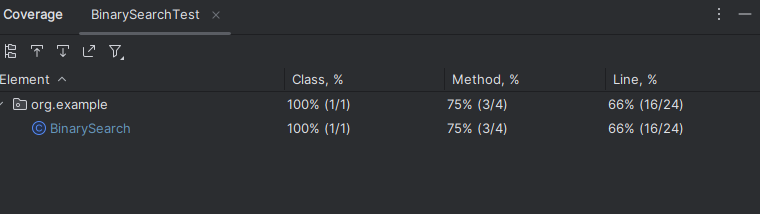

# Problem Statement 1:
Binary search is a divide-and-conquer search algorithm. Implement binary search to find the
position of an element in a sorted array. If the element does not exist, return -1.

### Input Format:
* First line: 𝑛(1 ≤ 𝑛 ≤ 105) the number of elements in the array.
* Second line: ‘n’space-separated integers in increasing order, denoting the elements of the array.
* Third line: ‘q’ (1 ≤ q ≤ 100), the number of queries.
* Next ‘q’ lines: An integer representing the element to be searched.

### Output Format:
* For each query, return the index of the element in the array or -1 if the element is not present

## Time Complexity:
#### Binary Search:
The binary search algorithm used in the `binarySearch` function has a time
complexity of O(log n), where 'n' is the number of elements in the sorted array. This is because,
with each iteration, the search space is divided in half.

#### Input:
The time complexity for reading input is O(n) where 'n' is the number of
elements in the sorted array.

#### Processing:
The code processes 'q' queries, where 'q' is the number of queries. For
each query, it performs a binary search, which is O(log n). So, the total time complexity for
processing all questions is O(q * log n).

#### Overall
The overall time complexity of the code is O(n) for input reading and O(q * log n) for
processing queries. The dominant factor here is the binary search, which is O(q * log n)
in the worst case.

## Space Complexity:
#### Input Storage:
The code stores the sorted array of 'n' elements, with a space complexity of O(n). 
#### Query Variables:
The space used for storing query-related variables (such as `target`, `left`,`right`, `mid`, and `result`) is minimal and constant, so it's O(1).

The size of the sorted array primarily determines the space complexity, so the overall space
complexity is O(n).

#### Overall 
In summary, the time complexity of this code is O(n) for reading input and O(q * log n) for
processing queries. The space complexity is O(n) due to the storage of the sorted array. The
space used for query variables is minimal and constant.

## Code Coverage
